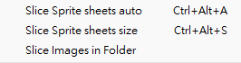

English | [繁體中文](README_TCH.md)
# UnityCutSpriteSheetViaScript
a script help you cut sprite sheet automatically

# How to use
Put "Editor" folder in your unity project's "Assets" folder.

it will add menu item in tools menu.

# Introduction
There are two scripts in this repo:
* SpriteCutter.cs
  * There are two mode "auto" and "size" can be use.
  * This script add "Slice Images in Folder" and "Slice Images in Folder" in tools bar.
  * Can press short cut to use script
* SpriteCutterFolder.cs
  * This script will cut all the png image in the selected folder. Using size(can be edit in script).
  * It will show file explorer to you for selecting folder path

# Reference
* [Editor script to slice sprites UnityQA](https://discussions.unity.com/t/editor-script-to-slice-sprites/135690)
* [AutoSpriteSlicer.cs](https://gist.github.com/shadesbelow/8a6ddc54db795241f3cff539db6ea487)
