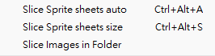

[English](README.md) | 繁體中文
# Unity使用腳本切割sprite切片
一個可以幫你快速在unity自動切割圖片的腳本。

# 如何使用
將 "Editor" 資料夾放入專案中的 "Assets" 資料夾中。

腳本會添加選項到頂端 "Tools" 的選單中：

# 介紹
此儲存庫有如下兩個腳本：
* SpriteCutter.cs
  * 可以使用 "auto" 和 "size" 模式："auto" 等同於使用 sprite editor 的 auto 模式；"size" 則是指定尺寸來切割，可以在腳本中來修改尺寸
  * 此腳本會添加 "Slice Images in Folder" 和 "Slice Images in Folder" 選項到 "Tools" 選單中
  * 可以使用快捷鍵來使用此腳本
* SpriteCutterFolder.cs
  * 此腳本會自動切割指定資料夾中的所有 png 檔案(使用尺寸來切割，可以在腳本中修改尺寸)
  * 啟動腳本時會跳出檔案總管，以利選擇指定資料夾

# 參考
* [Editor script to slice sprites UnityQA](https://discussions.unity.com/t/editor-script-to-slice-sprites/135690)
* [AutoSpriteSlicer.cs](https://gist.github.com/shadesbelow/8a6ddc54db795241f3cff539db6ea487)
